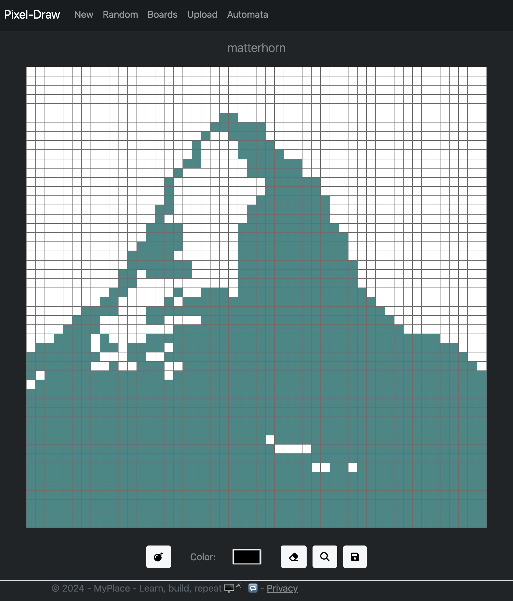

# Pixel-Draw

### Description
Pixel-Draw is a simple web application that allows users to draw pixel art while broadcasting their drawing to other 
connected users. The app allows users to draw pixel art on a canvas and save their 
drawings or download them to file. Pixel-Draw allows users to upload images and convert them to pixel art.

### Features
- Draw pixel art on a canvas
- Broadcast drawings to other connected users (via websockets)
- Save and download drawings
- Upload images and convert them to pixel art
- Plus: Cellular Automata JS animation

### Trying the App
[https://pixeldraw.azurewebsites.net/](https://pixeldraw.azurewebsites.net/)

